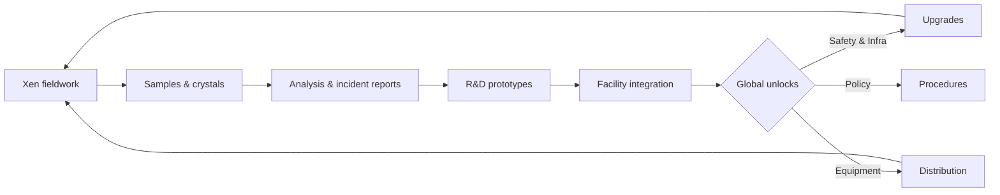
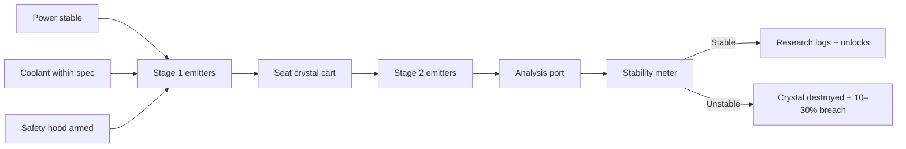
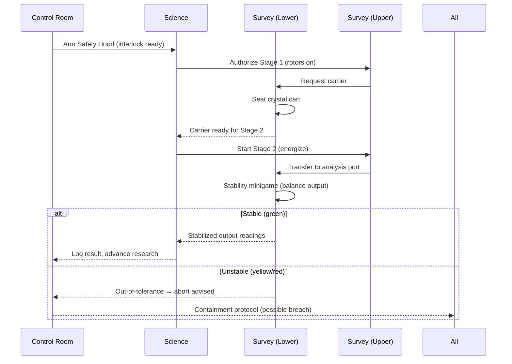

# Main Server

The **Main Server** is the beating heart of Project Ordinance—a persistent Black Mesa simulation where small decisions compound into facility-wide consequences. Every department has work to do, and the campus only functions when those jobs interlock: scientists run studies, logistics move gear, maintenance keeps the grid alive, security protects people and evidence, and administrators set priorities that ripple through everything else. The experience is completed by two dedicated companions: the **Xen Server**, where survey teams conduct risky field science under alien skies, and the **Surface Server**, where the HECU and Black Operations mobilize out of Santego Base for mission-driven deployments. All three servers talk to each other through systems and events, but the day-to-day loop lives here inside the facility.

!!! tip "How to read this page"
    This isn’t a checklist—it’s a **guidebook**. Sections below describe how systems feel in play, not just what buttons they expose. Use it to **roleplay with the simulation**, not around it.

---

## Gameplay & Environment

Black Mesa is designed to feel like a workplace that can go wrong in interesting ways. Routine anchors the flow: you clock in, check terminals, inspect labs, and make your area safe for the next person. But routine is fragile. The Office and Administration spaces generate priorities and paperwork; Sector E’s biodomes and labs produce data and danger; the Lambda Complex experiments with where a thing should be, not just what it is; the Anti-Mass Spectrometer turns preparation into ceremony. Tunnels, tramlines, maintenance corridors, cafeterias, dorms, and the medical bay stitch these spaces together so that when a call goes out—power loss, gas alarm, breach—you can reach the problem before the problem reaches you.

??? info "Design intent: walkable loops"
    Corridors are long enough to feel like a place, short enough to keep **response times** playable. Choke points create drama during evacuations but avoid hard locks unless the **clearance system** says so. Social rooms (cafeteria, dorm commons) are on purpose: planning happens where people collide.

---

## Systems as a Living Loop

The simulation is a loop: **discover → build → integrate → stress → learn**. Research converts risk into progress; operations convert progress into reliability; events stress both. What matters isn’t one miracle invention—it’s whether the facility can keep inventing while everything shakes.

### Research (Tree, Labs, and Proof)

Research is a **collective engine** rather than a personal tech list. Survey teams return from Xen with crystals and biosamples that scientists analyze into reports; R&D turns those reports into prototypes; logistics and maintenance shepherd equipment into real rooms; administrators set what gets attention next. As the tree matures, the facility changes texture: HEV suits get smarter, teleportation protocols get safer, chargers and analyzers get faster, and even mundane work (doors, lifts, cameras) becomes less brittle. The tree completes when the facility knows too much to sit still, at which point the world must choose whether to shut down cleanly or listen to the song a little longer.

!!! note "Evidence, not vibes"
    Breakthroughs need **data**. Prototypes that skip paperwork don’t move the tree; they move the **risk meter**.

### Science Disciplines (Crystal, Bio, Chemical)

Crystal work starts with ignorance and ends with categories. White, untyped clusters are stabilized long enough to be **measured**, then either refined for funding and materials or diverted into higher-order studies. Tier-3 energy signatures demand ceremony: extra checklists, extra hands, and the humility to abort. Biological science asks which yields more truth—containment or dissection—and uses biodomes as both farm and classroom. Chemical work mixes Earth reagents with alien biomass inside equipment that is only as safe as its calibration. The best labs are boring for long stretches because **boring is a safety feature**.

??? warning "On complacency"
    Repeating a procedure without logging its context creates **ghost variance**—the lab believes it’s repeating yesterday, but the room, gear, and people are all slightly different.

### Maintenance & Logistics (Keep the World Standing)

The complex breaks like a real building. Power boxes trip and turn a wing into a cave. Doors forget whose business they are. Elevators sulk. Trams develop artistic opinions about rails. Maintenance work is quiet heroism: small fixes prevent large disasters, and timing is the difference between a reset and a minor scare. Logistics closes the loop by moving requests from terminals to hands, ensuring the right prototype or part is **where** it is needed **when** it is needed. Together, they turn a research site into a survivable campus.

### Economy (Budgets, Salaries, Grants, Burn)

Funding is fiction with teeth. The facility starts with a global budget that looks generous until disasters send invoices. Departments have their own ledgers for equipment and consumables. Salaries land on a cadence so personal economies stay interesting; ATMs make that visible. Grants arrive with strings—install cameras, sustain a study without incidents, raise uptime—and those strings teach discipline. Carelessness isn’t only dangerous; it’s **expensive**.

### Events (Escalation and Immunity)

Events act like an immune system. Neglect turns into a reaction: a small leak becomes a corridor closure, a corridor closure becomes a wing evacuation, a wing evacuation becomes a cross-server incident. The trick is interruption. Isolate now, repair now, evacuate now—debrief later. When you respect the loop, the loop respects you. When you chase points, the facility notices and **pushes back**.

---

## Anti-Mass Spectrometer (AMS)

The **Anti-Mass Spectrometer** is a live, multi-role operation that binds Survey, Science, and the Control Room into a single high-risk, high-reward procedure. It’s not a cutscene: it’s a coordinated sequence of checklist gating, chamber handling, beam exposure, and live stability management on a Xen crystal sample. When it succeeds, analyzer data flows into research logs, unlocking new tech and improving facility capability. When it fails, the sample is destroyed and the facility absorbs both the financial and operational shock — up to and including localized Xen breaches that can snowball if ignored.

### Preconditions & safety envelope

AMS runs only begin when the facility is **in spec**. Maintenance must verify uninterrupted **power** to the AMS grid and steady **coolant** to both chambers. In the Control Room, the **Safety Hood** must be armed; it’s the interlock that prevents accidental energization. These checks aren’t cosmetic — they meaningfully change the odds. If you rush the sequence during an outage, coolant fault, or unresolved incident, you’re gambling with the entire facility.

!!! warning "Do not green-light during instability"
    If power is flickering, coolant is out of tolerance, or incidents are unresolved, **delay the run**. The AMS magnifies small problems into large ones.

### Orchestration across roles

**Survey** crews physically guide the crystal through mechanical stages (seating the cart, aligning for the beam window) and operate the **stability meter** during exposure. **Science** sequences the emitters, watches diagnostics, and authorizes progression gates. **Control** arms interlocks, audits checklists, and can **abort** if tolerances drift. During Stage 2, the Survey console displays a meter with **green / yellow / red** zones: sustained green indicates a clean read; lingering in yellow or red destabilizes the lattice and risks a breach.

### AMS flow (process overview)

### Role hand-offs (interaction timeline)

### Outcomes & consequences

A **successful** run produces analyzer records that feed the Research Tree and often unlock prototype equipment, while boosting confidence and funding. A **failed** run destroys the sample, imposes repair costs, and may trigger a localized **Xen breach** if the exposure was unstable. Repeated failures without corrective action **compound global instability**, tightening budgets and slowing unlocks at the exact moment you need them most.

!!! danger "Breach escalation"
    Multiple failed runs within a short window raise the background risk of a wider incident. If left unchecked, AMS activity can become the flashpoint for **Resonance Cascade** conditions.

---

## Factions & Roles

- The **Science Division** turns danger into knowledge: biologists wrangle life, chemists refine it, R\&D bends it into tools, and survey teams feed the loop from Xen.

- **Service & Logistics** keep the body alive by making repairs before they are emergencies and moving the right parts to the right rooms at the right time. **Security** enforces clearances, preserves chain-of-evidence, and runs toward the noise with discipline rather than bravado.

- **Administration** defines the why—priorities, funding paths, and the tolerances the whole facility will accept.

- Offsite, the **Surface Server** hosts **HECU** for containment and **Black Operations** for deniable removal, both whitelisted and mission-gated so their gravity enters the facility at the right moments.

- On the **Xen Server**, survey teams step into a world that punishes haste and rewards preparation, turning field risk into facility progress.

---

## Servers (Shape of the World)

The three servers divide labor so that each can be tuned to its purpose without flattening the experience into noise. The **Main Server** owns routine, responsibility, and recovery. The **Xen Server** owns expedition, scarcity, and exposure. The **Surface Server** owns orders, timers, and rules of engagement. Characters primarily live on the Main Server, but their work affects and is affected by the other two—shipments, alerts, breaches, missions.

* [x] **Main Server** — facility simulation and day-to-day loop
* [x] **Xen Server** — borderworld expeditions and resource risk
* [x] **Surface Server** — HECU & Black Ops deployments from base

---

## Clearance, Access, and Culture

Clearance is a **promise**, not a key: a promise that you know what a room can do to you and what you can do to a room. Scanners and readers exist to keep honest people honest and to give security something to measure. Culture finishes what devices start. People who treat doors as puzzles break the facility faster than any creature from Xen.

!!! warning "Play the badge"
    If you have to ask whether you should be in a room, **you shouldn’t**. Call it in; let someone with the right badge take the risk.

---

## Tools & Work Aids

Characters are more than their uniforms. An **animation wheel** turns body language into a language you can read. A **bodygroup manager** makes PPE and role cues visible. **VOX announcements** give the facility a voice that can warn or reassure. Radios run on batteries on purpose—silence is a mechanic, not a bug. Whiteboards and terminals make paper trails literal; incidents that aren’t written down **didn’t happen** when policy needs proof.

---

## Progression, Reset, and Memory

When the Research Tree fully matures, the facility must pick an ending: a **clean shutdown** that grants prestige for the next season or a **catastrophic failure** that stains it. Either way, the world resets with memory. Funding seeds change, price curves bend, and early research steps take different effort. It isn’t a wipe; it’s **seasonality**—a chance to prove the team learned something worth carrying forward.

!!! note "Prestige, not power creep"
    Bonuses are gentle: better seeds, smoother early unlocks, lighter paperwork loads. The goal is **momentum**, not trivialization.

---

## Departments at a Glance

Below is a **sortable data table** to help new players map responsibility to gameplay texture. It’s not exhaustive; it’s enough to start a conversation with your lead.

| Department       | Primary Responsibilities                                | Typical Interactions                       |
| ---------------- | ------------------------------------------------------- | ------------------------------------------ |
| Science          | Analysis, prototypes, reports, AMS/Lambda readiness     | Survey, Logistics, Administration          |
| Service          | Repairs, custodial safety, fire & evac readiness        | Security, Logistics, All Labs              |
| Logistics        | Requests → parts → delivery → installation coordination | Service, Science, Administration           |
| Security         | Clearances, custody, incident response & evidence       | All Departments, especially Administration |
| Administration   | Priorities, funding paths, quotas & audits              | All Departments, external grants           |
| Survey (Xen)     | Field collection, crystal/bio capture, site recon       | Science, Security (extractions), Logistics |
| HECU / Black Ops | Mission-driven containment / deniable removal (Surface) | Administration, Security (briefed events)  |

---

## Quick Reference (Lists & Definitions)

* [x] Facility simulation first
* [x] Research requires evidence
* [x] Repairs before risks
* [x] Radios die; procedures don’t
* [x] Write it down

Term
: **Evidence chain** — The paper trail that gives security and admin the authority to act without guessing.
: **Abort culture** — The expectation that anyone can stop a process that feels wrong, without punishment.
