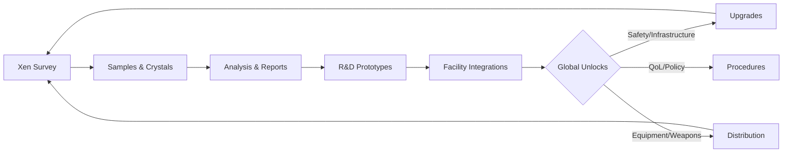
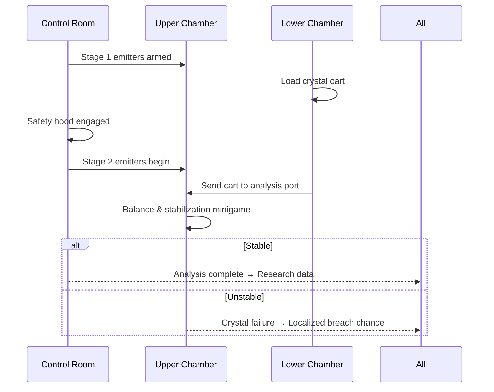

# The Main Server

The **Main Server** is Black Mesa’s living core: labs hum, cafeterias chatter, power grids strain, and every department pulls in a different direction until the facility demands everyone pull together. Project Ordinance runs as a connected trilogy of servers — the **Main Server** (facility), the **Xen Server** (borderworld), and the **Surface Server** (military). Characters and factions exist primarily on the main facility, while Xen expeditions and surface deployments happen on their dedicated shards. This three-server shape keeps each space focused and prevents the facility simulation from collapsing into a single chaos soup.

\=== "Main"
Inside the complex, the day starts with routine: shift change, lab doors unlocking, terminals booting. But the routine is fragile. A late maintenance ticket, a miscalibrated emitter, or an ambitious experiment can force half the departments into crisis mode. The main shard is about **work**, **coordination**, and **consequence**.

\=== "Xen"
The borderworld is not an exotic safari — it’s a field site. Survey teams venture out to gather crystals and biosamples under severe risk. Light, air, terrain, predators: Xen punishes haste. The shard is expeditionary, meant for **short, high-risk sorties** that feed research and the economy back home.

\=== "Surface"
The military shard hosts **HECU** and **Black Operations** at the Santego base. These deployments are whitelisted and mission-driven. They do not “free roam” the facility; they mobilize with orders, objectives, and timers, intersecting the main server through **events** rather than constant presence.

---

## Gameplay & Environment

Black Mesa is built from sectors that behave like organs in a body. Administration and offices pump paperwork and priorities. Sector E grows things that do not belong on Earth. Maintenance and Logistics keep blood—power, coolant, parts—moving. Lambda shunts energy and matter between worlds. The **Anti-Mass Spectrometer** is the facility’s beating heart: a temperamental, glorious machine that turns the whole complex into a single point of failure when it spins up.

The map is paced for **work → disruption → recovery**. You’ll take a seat, clock into a terminal, and then a corridor goes dark or a pressure alarm rises. The layout rewards proximity: tunnels and trims connect labs to workshops, cafeterias to dorms, security to detention. It’s a campus that feels traversable, with enough choke points to make emergencies dramatic but not random. Social spaces matter as much as critical rooms. People meet there, plan there, argue there.

!!! tip "Pro move"
Keep one eye on **facility status** displays even during calm shifts. They foreshadow outages and save minutes when everything starts breaking.

---

## Systems as a Living Loop

### Research as a Collective Engine

The **Research Tree** is not a menu you fill; it’s a **supply chain** that spans shards. Samples from Xen become hypotheses in Sector E, become prototypes in R\&D, become equipment and policies that change everyone’s day. Administrators set **priority lines** — safer teleportation protocols, higher-capacity chargers, protective suits — and departments route effort accordingly. Reports, failures, and near-misses are data; paperwork is part of science. When the tree reaches critical completion, the facility faces a decision point: wind the machine down cleanly, or let it sing until the metal screams.

### Science Disciplines

**Crystal studies** turn white, untyped clusters into known quantities. Most are low to mid energy; a few are **tier-3 hazards** that chew through protocols and patience. The analyzer tells you what you brought back; the refiner decides if it becomes money, material, or a mess. **Biological work** asks whether you can keep something alive long enough to learn from it, or whether dissection gives more answers; biodomes double as observation and farming spaces. **Chemical research** is controlled chaos: Earth reagents meet alien biomass, with guardrails provided by experience and equipment quality. The best labs are meticulous and boring—right up until they’re not.

??? info "On risk and escalation"
A poorly timed calibration or a cavalier protocol breach in any discipline increases **global risk**. Long streaks of bad practice accumulate like static and discharge as **events**. Use checklists. Use peers. Use the radio.

### Maintenance & Logistics

The facility **breaks like a real building**. Power distribution throws fits. Doors misbehave. Elevators sulk. Trams occasionally decide they’re art installations. Maintenance is the slow hero of the simulation: fix things early, or you’ll fix bigger things later. Logistics is the other half — terminals for requests, storage for parts, carts for deliveries. Big-ticket gear ships only after clearances, funding, and research all nod in unison. Every repair and delivery is a nudge that keeps Black Mesa on its feet.

### Economy & Consequences

Budgets here are **fictional but tight**. Global funds keep the lights on and the big toys humming; departmental funds are where players feel pain and pride. Equipment costs money. Accidents cost more. Salaries deposit on a fixed cadence with taxes and interest to keep personal economies from stagnating. Grants exist, but they arrive with strings: install a network of cameras, complete a study line, reduce incident rates for a month. When the facility is reckless, it doesn’t just spawn monsters — it **bleeds money**.

### Automatic Events

Events are the simulation’s immune response. A neglected power grid becomes a blackout. A sloppy chemical session becomes a gas alert. A long Xen dwell becomes a breach. If you chase points without respect, the facility notices and pushes back. The trick is **interrupting escalation**: repair now, isolate now, evacuate now, then argue about whose fault it was over coffee. This loop is why ordinary rooms have extraordinary nights.

---

## Character Creation & Tools

Black Mesa hires people, not loadouts. You apply for a job: write a biography, pick a department, accept that staffing needs trump wishlists. The **trait** layer makes the mundane interesting — advantages like **Thick Skin** or **Cat Eyes** alongside Achilles heels like **Clumsy** or **Four Eyes**. Good characters are a tangle of competence and fragility, and the server rewards you for playing both.

Moment-to-moment roleplay is supported by an **animation wheel**, **bodygroup manager**, **VOX announcements**, and **battery-bound radios**. Whiteboards let you sketch plans or taunt coworkers; terminals let you file reports, request gear, and broadcast the necessary bureaucracy that keeps experiments from turning into eulogies.

---

## Factions & Inter-Server Shape

The **Science Division** is the momentum of the server: biologists, chemists, R\&D, and survey teams pulling knowledge out of danger. **Service & Logistics** make the place function — the messes they clean and the parts they move are what keep emergencies from becoming tragedies. **Security** holds the line on clearances, evidence, and arrests, and they’re first to run into the dark rooms. **Administration** sets the **why**: priorities, budgets, and pacing. On the **Surface Server**, **HECU** executes containment and **Black Ops** executes silence. On the **Xen Server**, survey teams do field science under alien skies, closing a loop that keeps the main server fed with raw material and hard questions.

---

## The AMS: Ceremony & Failure

The **Anti-Mass Spectrometer** is both showpiece and stress test. When it spins up, the facility becomes an orchestra pit: upper chamber, lower chamber, control room, tunnels, coolant, safety hoods, carts, emitters, doors. Timing is everything, and so is humility.

---

## Map Sectors at a Glance

Below is a **card grid** overview. Use it like an index: click into each sector’s subpage once you split this monolith later.

* **Office & Admin** — briefings, budgets, bickering
* **Sector E** — biodomes, biolabs, biohazards
* **Lambda Complex** — teleportation, portals, protocols
* **AMS Suites** — glory and ash
* **Logistics & Tunnels** — parts in, trash out
* **Dorms & Medical** — recovery, gossip, paperwork
* **Security & Detention** — clearances, custody, chain-of-evidence

---

## Imagery & Captions

{ align=right }

---

## The Cycle: Prestige & Reset

When the tree is complete and the AMS has made its case, the facility enters **endgame**. A clean shutdown grants **prestige benefits** for the next cycle — modest boosts to seed funding, gentle discounts, faster early research. A catastrophic failure seeds the next run with **handicaps**. Either way, the world resets with a memory of who you were and how you worked. It is not a wipe; it is a **season**.

!!! note "Design intent"
Endgame is a sigh and a smile, not a shrug. The reset should feel **earned**: a ritual that rewards discipline or enshrines hard lessons.
