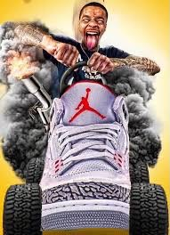

<!-- markdownlint-disable MD033 -->
# Team

This page lists the current staff roles and members for Project Ordinance.

> Last updated: 2025-08-12. If your role, name or description may be outdated, please open an issue/PR.

## Owner

Owners set the overall direction of the project, align roadmap and priorities, and oversee infrastructure and partnerships.

    

        
        

            
Riggs

            
Founder and project lead; oversees development, roadmap, and infrastructure. Riggs is the owner and key to the success of Ordinance, serving as the main programmer and only mapper. With at least 7 years of development experience, he is the backbone of the project.

        

    

## Server Representative

Represents the server externally and internally—collects player feedback, manages outreach, and coordinates with leadership on community needs.

    

        
        

            
Field

            
Known as Drew, he was the project lead of Project Resonance and decided to take the role of server representative for Project Ordinance.

        

    

## Staff Manager

Oversees the entire staff team—recruiting, training, scheduling, and maintaining internal guidelines and workflows.

    

        
        

            
Chad

            
Co-lead of Project Resonance, he chose to carry over as staff manager for Project Ordinance.

        

    

## Server Administration

Administrators keep servers healthy and policies consistent. They handle escalated moderation, configure tooling, and support events and operations.

    

        
        

            
Captain Johnny Sins

            
Previously a gamemaster in Project Resonance, he transitioned to an administrator role for Project Ordinance.

        

    

    

        
        

            
KingKuj

            
Administrator supporting policy enforcement and backend coordination.

        

    

    

        
        

            
Lee West

            
Administrator with community management experience; maintains standards and outreach.

        

    

    

        
        

            
LordMax

            
Long-time administrator ensuring smooth day-to-day operations and member support.

        

    

## Server Moderator

Moderators handle day‑to‑day community safety—monitor chats and voice, resolve tickets, and help onboard new players.

    

        
        

            
Atlas

            
Transferred from Project Resonance during the merge; continues to focus on chat moderation and ticket support.

        

    

    

        
        

            
Harry Pootis

            
Carried over from Project Resonance; assists with voice moderation and player support.

        

    

    

        
        

            
The G-Ninja

            
Retained from Project Resonance; provides coverage and first-response help across time zones.

        

    

## Server Gamemaster

Gamemasters design and run events, craft storylines, and coordinate with staff to keep gameplay fresh and engaging.

    

        
        

            
Cheeky

            
A gamemaster with a very significant interest in apples and propeller hats; Cheeky designs playful, thematic events and storylines and keeps sessions light‑hearted while coordinating with the team.

        

    

## Media Team

The media team produces promotional content, maintains brand visuals, and supports documentation—trailers, screenshots, wiki content, and lore presentation.

    

        
        

            
CreekMando

            
Currently tasked with populating portions of the wiki and developing more structured lore.

        

    

    

        
        

            
Kul

            
Part of the media team; recently produced our <a href="https://www.youtube.com/watch?v=NZhnvHiR_mc" target="_blank">promotional YouTube video</a> showcasing the Survey Team department of the Science Team faction.

        

    

